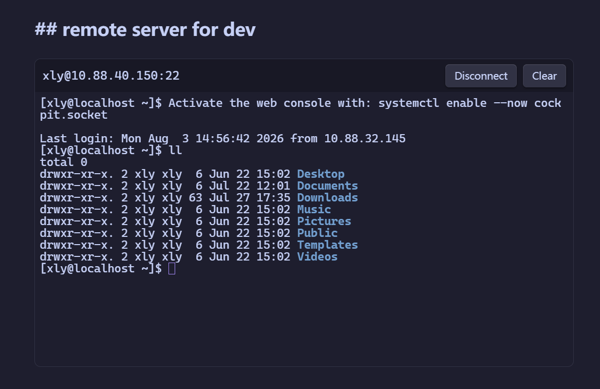

# Obsidian SSH Terminal

[English README](README.md)

在 Obsidian Markdown 中直接运行交互式 SSH 终端。SSH Terminal 会把 `ssh` 代码块渲染成可连接的终端，适合运维笔记、实验记录、服务器操作手册和需要复制执行环境的 Markdown 文档。



## 功能亮点

- 支持直接在 Markdown block 里写入连接信息，包括明文密码。
- 渲染文档不会自动连接，只有点击 **Connect** 才会发起 SSH 会话。
- inline 和 profile 两种模式都执行严格的主机指纹确认。
- 每个终端实例独立运行，支持 resize，并在卸载时清理会话。
- 需要保护密码时，可以改用 profile 模式，将密码加密保存到插件数据中。

## 快速开始：Markdown 明文密码模式

最快的使用方式是直接把连接字段写进 `ssh` block：

````markdown
```ssh
host: server.example.com
port: 22
username: root
password: "replace-with-password"
height: 360
```
````

在阅读视图或实时预览中打开文档，然后点击渲染终端里的 **Connect**。

inline 模式要求 `host`、`username` 和字符串类型的 `password`。`port` 默认 `22`，`height` 默认 `360`，连接超时固定为 `15000ms`。纯数字、布尔值或包含 YAML 特殊字符的密码建议加引号。

> 警告：inline 密码会作为 Markdown 明文保存，可能进入 Obsidian Sync、云盘、备份、全文索引或 Git 历史。不要把高敏感密码写进共享笔记或公开仓库。需要保护秘密时，请使用 profile 模式。

## Profile 模式

Profile 模式把可复用的主机信息从 Markdown 中移出，并通过 Electron `safeStorage` 使用操作系统加密能力保存密码。

1. 打开插件设置。
2. 新建一个 profile，填写 host、port、username、timeout 和 password。
3. 在 Markdown 中引用 profile：

   ````markdown
   ```ssh
   profile: production-server
   height: 360
   ```
   ````

4. 在渲染出的终端中点击 **Connect**。

`profile` 不能与 `host`、`username`、`password` 等 inline 字段混用。

## 安全说明

- inline 模式会把密码直接保存在 Markdown 中，不会复制到插件数据。
- profile 模式会把加密后的密码 blob 写入插件 `data.json`，不会把明文密码写入 Markdown。
- 如果操作系统加密能力不可用，插件会拒绝保存 profile 密码，不会降级为明文保存。
- 首次连接采用 TOFU 主机指纹确认；已信任的主机指纹发生变化时，连接会被阻止。
- 插件日志、通知、状态文本和错误信息不会记录密码、输入命令或终端输出。

## 构建

需要 Node.js 20+。

```powershell
npm install
npm run check
npm run build
npm run package:release
```

发布产物位于 `release/community/`：

- `main.js`
- `manifest.json`
- `styles.css`

手动安装时，把这三个文件复制到 `<vault>/.obsidian/plugins/ssh-terminal/`。

## 发版

使用发布脚本更新 `package.json`、`package-lock.json`、`manifest.json`、`versions.json`，执行验证、构建发布产物、推送 tag，并创建 GitHub release。版本参数可以是明确的 `x.y.z` 版本号，也可以是 `major`、`minor`、`patch`：

```powershell
npm run release -- 0.3.0 --notes "Release 0.3.0"
npm run release -- minor --notes "Release next minor version"
```

如果 Obsidian 审核反馈后需要重建同一个版本，显式替换已有 tag 和 release assets：

```powershell
npm run release -- 0.3.0 --replace --skip-integration --notes "Release 0.3.0"
```

`--skip-integration` 只应在 Docker 不可用时使用。

## 集成测试

```powershell
docker build -t obsidian-ssh-test tests/fixtures/sshd
$env:OBSIDIAN_SSH_TEST_PASSWORD='<temporary-local-password>'
npm run test:integration
```

测试密码只通过环境变量注入，不应写入仓库文件。

## 首版范围

- 仅支持 Obsidian 桌面版。
- 仅支持密码认证。
- 暂不支持 SFTP、端口转发、跳板机、私钥、SSH Agent 和移动端。
